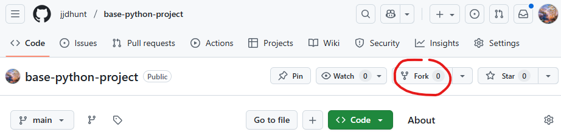
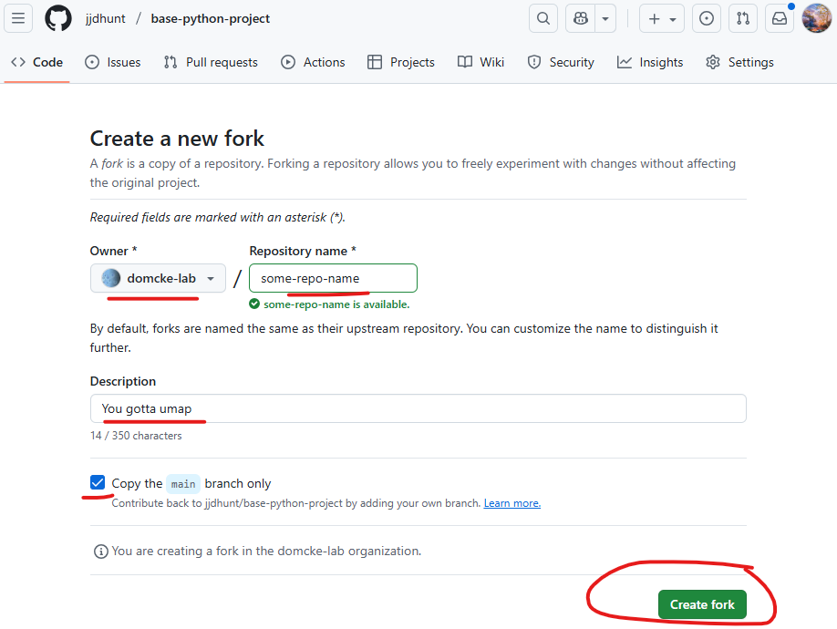
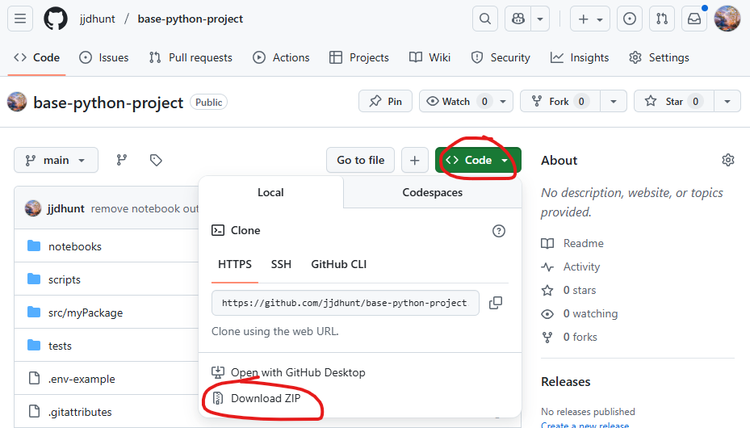

# Base Python Project Template

This repository serves as a good starting point for a python project. It uses a standard directory structure and has an example Jupyter notebook, script, python module, and tests to get your project going fast. It is highly recommended to use VSCode as your editor so some instructions below refer to it.

## Make the repository your own
On this repo's GitHub page, click the `Fork` button:



Select the owner of the new repository, give it a name and description, copy just the main branch, and click the `Create Fork` button:



After creating your fork of the repo, open VSCode and use the GUI in the Source Control tab to clone you repo to your local machine.

---
Alternatively, download the repository's code only as a single .zip file. This will disconnect the code from any of the git history:



## Setup

Open the project directory in VSCode on your local machine. Open a new terminal in VSCode in which to execute the commands below.

### Initialize git repository
If you are starting from a copy of this project (you downloaded a .zip from GitHub), rather than a fork of the repository, you should create a git repository with >`git init` or use GUI in VSCode source control tab. You can tell if your project has a git repository set up by looking for a directory called `.git` (may be hidden) in the top level directory of your project.

### Rename things in this starter project
1. This starter project uses the package name `myPackage`. You should update this name everywhere it occurs to a custom name for your project/package. Rename it in `pyproject.toml`, `tests\test_example.py`, `scripts\script.py`, and `notebooks\sandbox.ipynb` (or just use VSCode's project-wide search and replace tab). Your new name should only have alphabetical characters and no spaces.
1. Rename the directory `src/myPackage/` to the same name as above.
1. In `pyproject.toml`, replace the placeholder author with your name and email.
1. Rename `.env-example` to `.env`.

### Setup the environment

With one exception, you only need to do the following steps one time during initial project setup (the one exception is discussed below).

1. Create and activate a virtual environment:
   ```
   python -m venv .venv
   source .venv/bin/activate      # macOS/Linux
   .venv\Scripts\activate         # Windows
   ```
1. Install the project so you can import code from `src/`:
   ```
   pip install -e .
   ```
1. Install the optional extras used for tests and notebooks:
   ```
   pip install -e ".[dev]"
   ```
1. Remove notebook outputs automatically when you commit (run once during setup):
   ```
   nbstripout --install
   ```

You can also do these all in one line as >`python -m venv .venv; .venv\Scripts\activate; pip install -e .; pip install -e ".[dev]"; nbstripout --install` and go grab a coffee.

The one exception to the one-time environment setup is that >`source .venv/bin/activate` should be run in *each new terminal* in which you run any commands or code related to the project. A common source of confusion is trying to `pip install some-package` in a terminal which has not first had the project's virtual environment activated. In this case it will either fail or install the package into your global python environment which you project will not be able to see.

### Testing
Make sure everything is set up correctly by running the test suite with:
```
pytest
```
You should see all green and '3 passed'. If you see red or error messages, something is not set up correctly. Don't be afraid to just delete the whole project directory and start over fresh.

### Commit your updated project to git
Now that your project is all set up, you should commit it to git with >`git add .; git commit -m 'first commit` or use GUI in VSCode source control tab.

## General Development Best Practices
- Use branches when you try new ideas so you can go back if something breaks (>`git checkout -b NAME-FOR-YOUR-BRANCH`).
- Commit small chunks of work often (>`git add .; git commit -m 'a description of what you did'` or use GUI in VSCode source control tab.).
- Keep `pyproject.toml` up to date when libraries change so someone else can recreate your setup.
- Replace this README with project notes that explain how to run your analysis.
- Add simple tests in `tests/` when you write new functions; even tiny tests catch mistakes early.

## Project Structure
- `src/` holds importable project code. Rename `myPackage` in `pyproject.toml` and create a matching folder before sharing your work.
- `tests/` stores unit tests; add new tests as your project grows.
- `data/` contains raw or processed datasets and is ignored by Git.
- `notebooks/` is for exploratory notebooks; `nbstripout` removes notebook outputs, keeping them clean and small in the repository.
- `scripts/` is for repeatable, stable analyses. Typically, ideation and iteration happens in a notebook and as things become more finalized, code is moved to a script.

## Environment Variables
You may find yourself using APIs or other services that need private keys and passwords. These should **never** be written in your code itself as they will become public if they are committed to the repository. Instead you should store them in a .env file that is ignored by git and access them from there.

- Copy `.env-example` to `.env`.
- Store your secrets in .env using the `NAME="value"` pattern, for example:
  ```
  API_KEY="SOME_API_KEY"
  ```
- Load the values in your code with `python-dotenv`:
  ```python
  from dotenv import load_dotenv
  import os

  load_dotenv()
  api_key = os.getenv("API_KEY")
  ```
